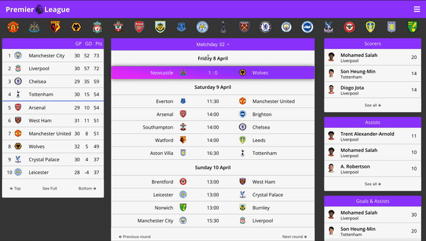

# Premier league app

This is a project I did at the end of my 7 month JavaScript course in [CodersLab](https://github.com/CodersLab).

It's a web application that allows to get up-to-date information about the English Premier League - upcoming matches, results, club information, standings and so on.

The live version can be checked at the following link https://premier-league-app.netlify.app
